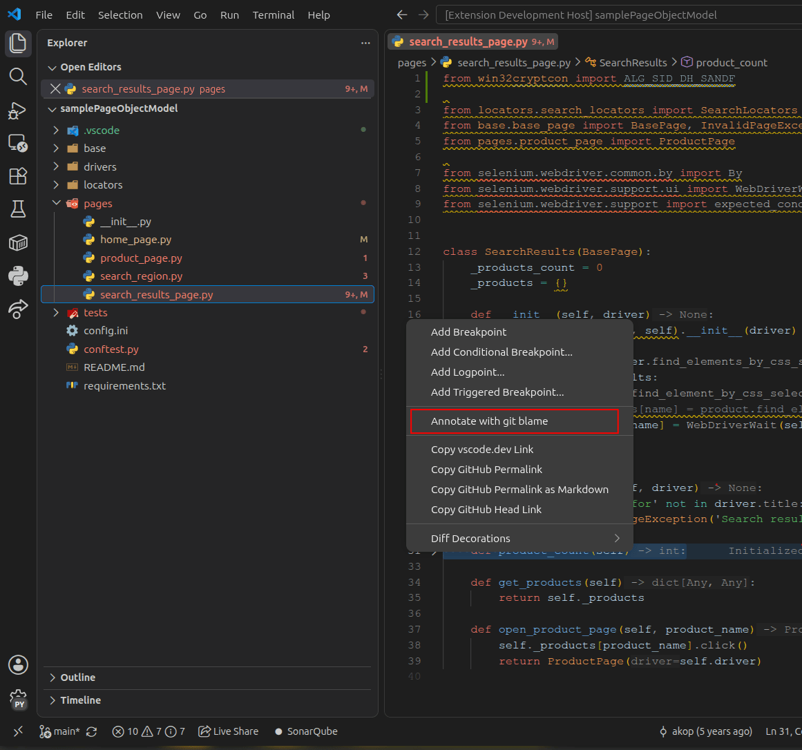
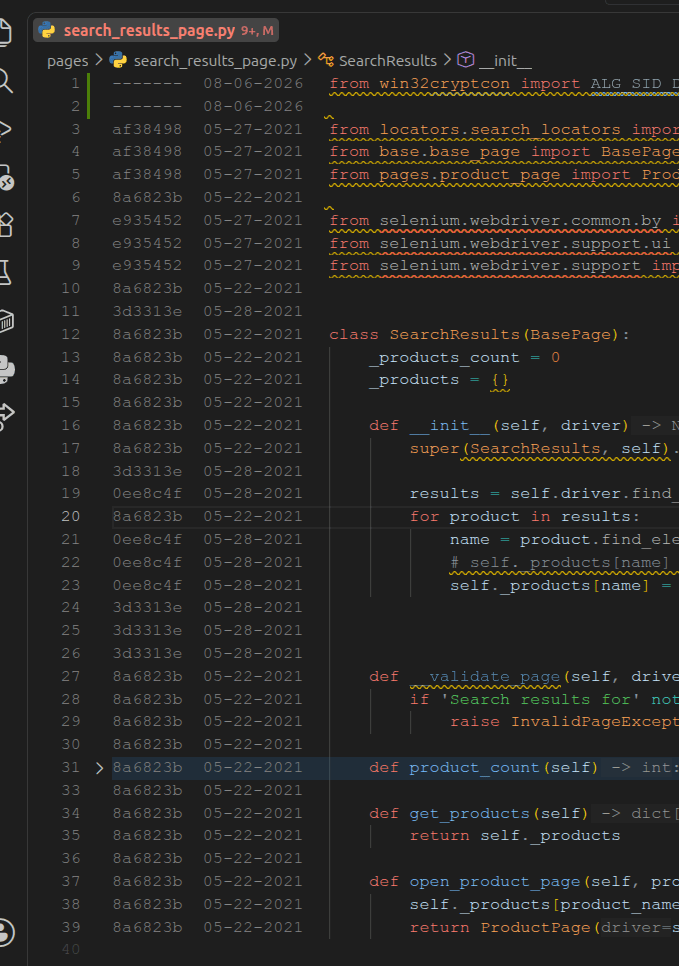
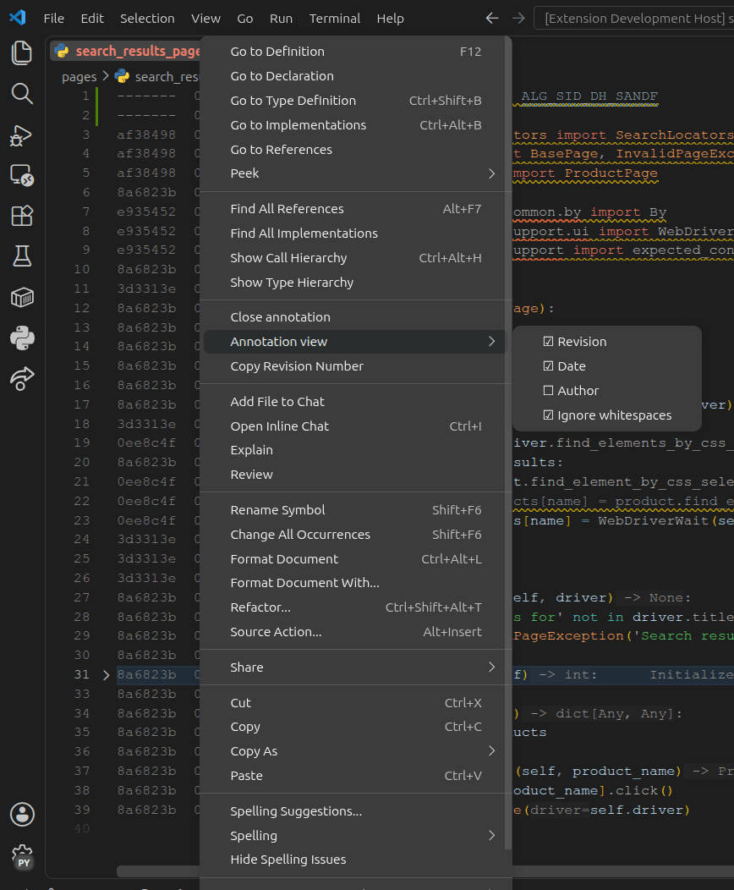

# BlameTrail

Show git blame information (revision, date, author) inline, right next to the line numbers of the file you're editing — driven entirely from the editor's line-number context menu.

## Screenshots

**Right-click a line number to annotate:**



**Inline revision, date, and author for every line:**



**Toggle exactly what's shown, right from the menu:**



## How to use

1. Right-click any **line number** in the editor gutter.
2. Choose **"Annotate with git blame"**.
   - If the file isn't tracked in a git repository, nothing happens.
   - Otherwise, blame info appears before each line: by default, **commit date** and the **author's first name**.
3. While annotation is active, right-click a line number **or** right-click the blame text/code itself (regular editor context menu) to get:
   - **Close annotation** — hides the annotation.
   - **Annotation view** (submenu) — checkboxes for what to display.
   - **Copy Revision Number** — copies the full commit hash of that line to the clipboard.
4. Hover over the annotation text to see the full commit hash, author, date, and commit message.

## Commands

| Command | Menu location |
| --- | --- |
| Annotate with git blame | Editor line-number context menu (shown when annotation is off) |
| Close annotation | Editor line-number context menu (shown when annotation is on) |
| Copy Revision Number | Editor line-number context menu (shown when annotation is on) |
| Annotation view ▸ Revision | Submenu checkbox |
| Annotation view ▸ Date | Submenu checkbox |
| Annotation view ▸ Author | Submenu checkbox |
| Annotation view ▸ Ignore whitespaces | Submenu checkbox |

The annotation on/off state is tracked separately per file: annotating one file has no effect on any other open file, and each file remembers its own on/off state as you switch between tabs.

## Settings

| Setting | Default | Description |
| --- | --- | --- |
| `blameTrail.showRevision` | `false` | Show the short commit hash. |
| `blameTrail.showDate` | `true` | Show the commit date. |
| `blameTrail.dateFormat` | `"YYYY-MM-DD"` | One of `YYYY-MM-DD`, `YYYY/MM/DD`, `MM/DD/YYYY`, `MM-DD-YYYY`. All four are the same length, so alignment isn't affected either way. The hover tooltip uses this same format. |
| `blameTrail.showAuthor` | `true` | Show the commit author. |
| `blameTrail.ignoreWhitespace` | `true` | Ignore whitespace-only changes when blaming (`git blame -w`). |
| `blameTrail.authorFormat` | `"First Name"` | One of `Initials`, `First Name`, `Last Name`, `E-mail`. If the chosen format can't be derived from the commit author's name, falls back to their e-mail — but only if it actually looks like a valid e-mail address (has an `@` and a domain). If a commit's recorded author e-mail is something like a stray placeholder value (e.g. `"password"`), it's treated as invalid and the author's name is shown instead, both in the inline annotation and the hover tooltip. |
| `blameTrail.maxAuthorLength` | `12` | Maximum characters shown for the author field; longer names/e-mails are truncated with an ellipsis (e.g. `JOROZC44_fo…`). Since every line's author is padded to match the longest one in the file, one unusually long name would otherwise widen the whole column and push all your code to the right — this caps that regardless of how long any single name gets. The hover tooltip always shows the full, untruncated name. |

These settings can be changed either from the **Settings** UI/`settings.json`, or directly from the **Annotation view** submenu checkboxes — both stay in sync.

## Requirements

- `git` must be available on the `PATH`.
- VS Code `^1.90.0` or newer (for the `editor/lineNumber/context` menu).

## Development

```bash
npm install
npm run compile      # or: npm run watch
```

Press `F5` in VS Code to launch an Extension Development Host with the extension loaded.

See [PUBLISHING.md](PUBLISHING.md) for how to package (`npm run package`) and publish to the Marketplace. See [CHANGELOG.md](CHANGELOG.md) for release notes.

## Known limitations

- Editing an annotated file (including running a formatter) clears its annotation immediately and re-runs `git blame` about half a second after you stop typing/the edit settles. Uncommitted lines show up as "Not Committed Yet".
- Settings (what to show, ignore-whitespace, author format) are global, not per file — they apply the same way to every currently-annotated file.
- Large files: blame runs via `git blame --line-porcelain`, which is simple and reliable but not specifically optimized for very large files.
